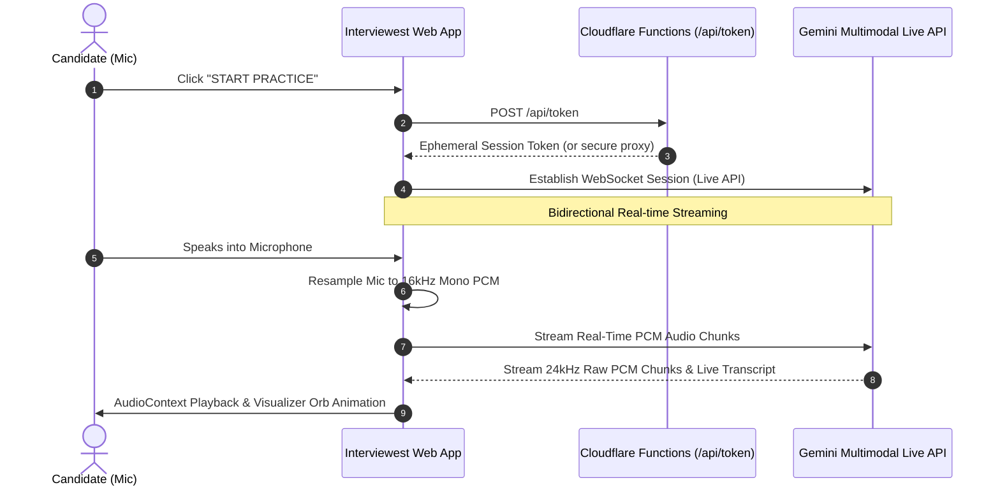

# Interviewest 🎙️⚡

<p align="center">
  
</p>

<p align="center">
  <strong>Master your next interview with playful, real-time AI voice practice.</strong>
</p>

<p align="center">
  
  
  
  
  
</p>

---

## Overview

**Interviewest** is a gamified, real-time conversational interview simulator designed to help job seekers overcome interview anxiety and sharpen their communication skills. 

Powered by the **Gemini Multimodal Live API** and hosted on **Cloudflare Pages**, Interviewest enables natural, low-latency, bidirectional audio conversations with intelligent interviewers that actively probe your resume's strengths and weaknesses.

---

## ✨ Features

- 🎙️ **Real-Time Duplex Audio Streaming**: Natural, uninterrupted conversation with Gemini over low-latency WebSockets with live candidate speech interruption support.
- 📱 **Mobile-Responsive Duolingo-Inspired UI**: Designed from the ground up for smartphones, tablets, and desktops with chunky 3D pressable buttons, playful color palettes, and touch-first ergonomics.
- 📄 **Multi-Format Resume Parsing**: Drag-and-drop support for **PDF**, **DOCX**, **TXT**, and **Markdown** resumes parsed entirely in-browser.
- 🔥 **Intelligent Hotspot Extraction**: Gemini automatically analyzes your career history to identify interview probing targets—such as rapid transitions, vague metrics, gaps, and standout accomplishments.
- 🎭 **4 Diverse Interviewer Personas**:
  - 🤝 **Friendly Coach & Peer**: Uplifting and constructive for low-stress prep.
  - 💼 **Senior Hiring Manager**: Evaluates strategic thinking, leadership, and team impact.
  - 💻 **Tough Tech Lead**: Deep dives into systems, edge cases, and architectural trade-offs.
  - 📋 **Behavioral Recruiter**: Tests STAR-method responses, culture fit, and soft skills.
- 🎯 **4 Dynamic Practice Modes**:
  - 💬 **Warmup Chat**: Casual, low-stakes introductory conversation.
  - 🎯 **Mock Interview**: Realistic, standard interview questions one at a time.
  - 💡 **Instant Coaching**: Real-time critique and advice after each response.
  - 🔥 **Hard Probing**: Aggressively challenges resume weak spots and bold claims.
- 🗣️ **5 Expressive AI Voices**: Choose between *Puck*, *Aoede*, *Charon*, *Fenrir*, and *Kore*.
- 🔒 **Zero API Key Leaks**: Secure, serverless token minting via Cloudflare Pages Functions ensures your raw `GEMINI_API_KEY` never touches client browser code.
- 💾 **100% Private Client Storage**: Practice transcripts, resumes, and histories are saved strictly to the browser's local **IndexedDB** with real-time storage quota monitoring.
- 🎧 **Hardware-Agnostic Audio Resampling**: Automatic high-fidelity downsampling of candidate microphone input to 16kHz mono PCM and playback of 24kHz Gemini audio streams across all browsers.

---

## 🛠️ Architecture & Audio Pipeline



---

## 🚀 Getting Started

### Prerequisites

- [Node.js](https://nodejs.org/) v18.0.0 or higher
- A Google Gemini API Key ([Get a free key from Google AI Studio](https://aistudio.google.com/))

### 1. Clone & Install

```bash
git clone https://github.com/your-username/interview-buddy.git
cd interview-buddy
npm install
```

### 2. Configure Environment

Create a `.dev.vars` file in the project root:

```bash
cp .dev.vars.example .dev.vars
```

Add your Gemini API key inside `.dev.vars`:

```ini
GEMINI_API_KEY=your_gemini_api_key_here
```

### 3. Run Locally

```bash
npm run dev
```

Open **`http://localhost:8788`** in your browser.

> [!NOTE]
> Web audio microphone capture requires a secure context (`localhost` or `https://`). Ensure you grant microphone permissions when prompted by your browser.

---

## ☁️ Deploy to Cloudflare Pages

### Option A: Using Wrangler CLI

Deploy directly to Cloudflare Pages with one command:

```bash
npm run deploy
```

Set your production API key secret:

```bash
npx wrangler pages secret put GEMINI_API_KEY --project-name interview-buddy
```

### Option B: Cloudflare Dashboard Git Integration

1. Push your repository to GitHub or GitLab.
2. In Cloudflare Dashboard, navigate to **Compute (Workers) > Pages > Connect to Git**.
3. Set the build settings:
   - **Framework preset**: None
   - **Build output directory**: `public`
4. Under **Settings > Environment variables**, add:
   - `GEMINI_API_KEY`: `your_gemini_api_key_here`

---

## ⌨️ Shortcuts & Controls

| Shortcut / Control | Action |
| :--- | :--- |
| <kbd>Space</kbd> | Toggle Microphone Mute / Unmute during practice |
| `🎙️ Studio` | Real-time interactive voice practice arena |
| `📄 Resumes` | Upload, manage, and inspect resume hotspots |
| `🏆 History` | Browse past session transcripts and export summaries |
| `📋 Copy` | One-click copy transcript to clipboard |

---

## 📱 Mobile Support

Interviewest is fully optimized for mobile devices:
- **Responsive Layout**: Designed for small screens (320px–480px), tablets (768px), and wide monitors.
- **Touch-Friendly Controls**: Touch targets conform to accessibility standards (minimum 44px height).
- **iOS & Android Safari/Chrome**: AudioContext automatically unlocks on user gesture; inputs avoid automatic zoom triggers.
- **Safe Area Insets**: Native padding for phone notches and navigation indicator bars.

---

## 🛡️ Security & Privacy

- **No Remote Database**: Your resumes and transcripts never leave your personal browser. They are persisted in local IndexedDB.
- **Token Shielding**: The client requests short-lived single-use auth tokens from `/api/token`, protecting your master Google API key from inspection.

---

## 📄 License

This project is open-source and available under the [MIT License](LICENSE).
